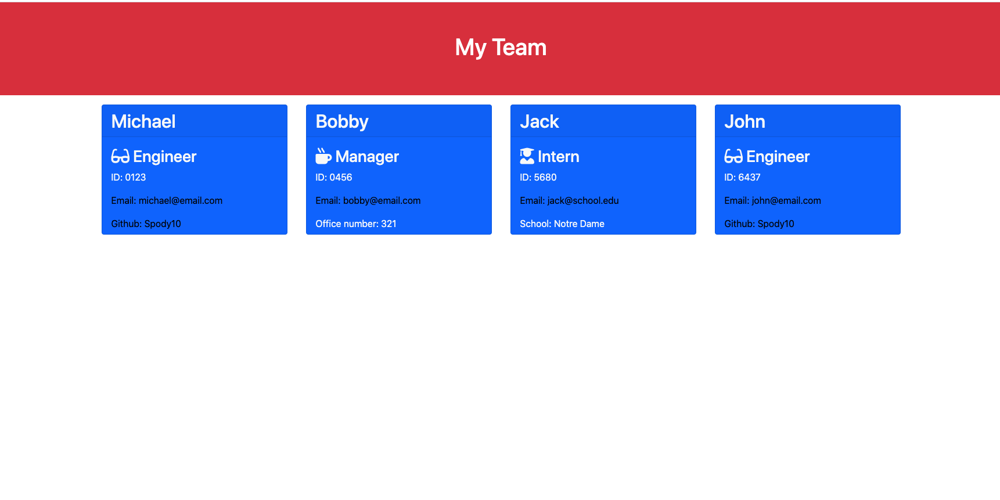

# Employee Info Generator

## Description

A node.js application that creates employee information based on user input.

---

## Table of Contents

- [Built With](#built-with)
- [Installation](#installation)
- [Usage](#usage)
- [Testing](#testing)
- [Contributors](#contributors)

---

## Built With

Javascript, Node.js, HTML, CSS, Bootstrap, Inquirer, Jest

---

## Installation

- To install and use, clone remote repo to local device.
- Open in your text editor (Visual Studio, etc.).
- Run "npm install" on the command line of editor, making sure the file path is in the root of the project directory.

---

## Usage

[Video tutorial of how to use this app: click here](https://drive.google.com/file/d/11gho4y6Id2VncoBVrJgBd0-9DhiBt8xv/view)

---

## Testing

On command line, type "npm test" to test total application. You can test individually by typing "npm test Engineer" or "npm test Employee", etc.

---

## Contributors

Michael Spore
[Spody10](https://github.com/Spody10)
[LinkedIn](https://www.linkedin.com/in/michael-spore-6898ba2b/)

---
